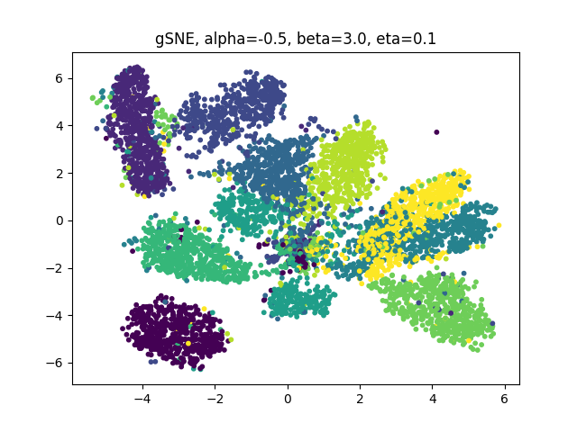

# gSNE: generalized stochastic neighboring embedding

This repository hosts the Pytorch codes for paper [On the Attractive and Repulsive Forces of Generalized Stochastic Neighbor Embedding with Alpha-Divergence](https://ieeexplore.ieee.org/document/10577172) by Hsin-Yi Lin, Huan-Hsin Tseng and Jen-Tzung Chien.

## Model

 gSNE utilizes a regularized power-law distribution with the α-divergence for manifold learning. It generalizes and incorporates various favorable features for the clustering process to provide high flexibility for reflecting the similarity properly between high and low-dimensional samples.

## Datasets
###  - [MNIST](http://yann.lecun.com/exdb/mnist/) ([default](https://github.com/hsinyilin19/generalizedSNE/blob/main/mnist.mat))
###  - [Coil20](https://www.cs.columbia.edu/CAVE/software/softlib/coil-20.php) 
###  - [Olivetti faces](https://www.cl.cam.ac.uk/research/dtg/attarchive/facedatabase.html) 

## Prerequisites
- [Python 3.11.7](https://www.python.org/)
- [PyTorch 2.2.0](https://pytorch.org/)
- [scipy 1.12.0](https://scipy.org/)
- [numpy 1.26.3](https://numpy.org/)
- [matplotlib 3.8.2](https://matplotlib.org/)

##  
An example of MNIST with $\alpha=-0.5$, $\beta=3.0$, $\eta=0.1$:

